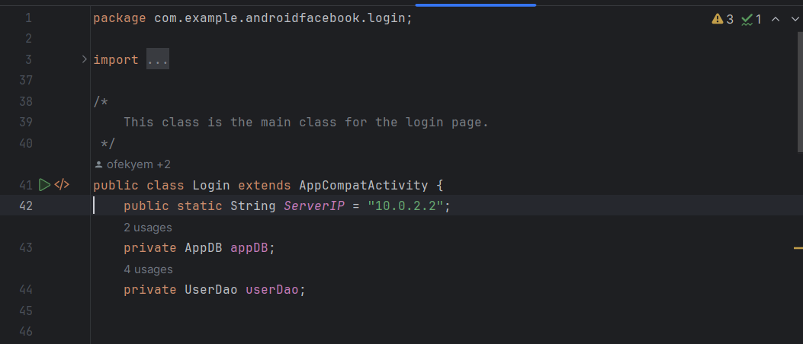

# Welcome to our Facebook Android App Project as part of the BIU Advanced Programming Course!

The Android app was developed in Android Studio software (please install this software!) and it is connected to a TCP server and a Node Js server so make sure you already followed their instructions (Folders "Bloom-filter and TCP-server" and "Node js Server"),
because it won't work without it! if you already done it continue...

If you want to read more about the bloom filter tcp server or the node js server please enter their repos and read their ReadMe files!

After you have done it, You can start with opening the Android Studio software,

Now, go to the software menu choose "open" and pick the folder "Facebook Android-App" that is in this repository. 

Now, pay attention that the server ip that the code is using right now is 10.0.2.2 that is working with the android studio emulators, 
if you are interested in running this app on your own
Android phone you need to make sure that your computer is connected to the same Wi-Fi as your phone and you need to put the Wi-Fi ip (ipv4) right here in the login file that is located in 

Facebook Android-App\app\src\main\java\com\example\androidfacebook\login.java

you need to change this ip to your Wi-Fi ip in this bolded line: 

And now, you are ready to start by pressing play on Android Studio! the first page you will see is the login page.

## Here's a video that shows what our app can do

https://www.youtube.com/watch?v=onclwdYc8EU

## first of all you need to register a user

New users can create an account by navigating to the Sign Up page by clicking "Sign Up for Facebook. They will need to provide a username, password (your password must contains at least 8 characters capital letter and a sign ), display name (the name that you and your friends will see in posts, comments and your profile page) , and a profile picture. u must fill all the inputs to create a user. after you are ready press Sign-Up. When you are chosing a profile picture make sure you pick from the gallery a photo in PNG or JPEG format and in size up to 2mb, you can also choose to open the camera.

## now you can login to your account!

Please enter the username and password of the account you have created and press Log-in and next page you will see is the feed page:

## What can you do in the Feed page?

In the top of the feed page you will see a navigation bar that can help you to get into some pages: 

* If you press the Person-Icon you will move into your profile account page.
* If you press the Bell-Icon you will move into the notifications page (if you have some notifications you will see a red circle with the number of notifications beside the bell icon).
* If you press the Menu-Icon you will have 4 options:
  1. darkmode/lightmode - change your app view into darkmode/lightmode depends on what you are right now.
  2. Edit User - navigates you to the Edit User page.
  3. Delete User - deletes your account from the server.
  4. Log Out - navigates you back to the login page.

Under the top bar you will see the text " What do you want to share" and next to it you will see the Add Post button which navigates you to the Add Post page.
Under it you can see the list of posts that contains the posts that are right now in the server and have been uploaded by users from the server (if there are no posts you won't see anything but a grey screen). You can notice that if you have more than 25 posts, 20 posts that shown up will be of your friends/yours and the other 5 of users that are not your friend. Every post contains the name of the user uploaded, his profile picture, the date, some text content and optionally a picture for the post. if the post is written by your user you will also see in the top right side of the post a Three-Dots icon that can let you delete the post from the server or navigate you to the Edit Post page. 
You can also notice that the post contains in the bottom of it a like counters that indicates how many likes the post have and some comments counter that indicates how many comment there are. 
You can also click on the like icon button (click on the icon itself not on the "like" text!) to do/undo like for the post, you can see it will add/decrease from the counter.
if you click on the comment icon you will navigate to the Comments Page of the post. And also you can see a share button that will open up for you a little menu with options of share. 

You can also click on the Profile Picture of one of the posts writers to navigate into his Profile Page. 

## What can you do in the Add Post page? 

If you want to add a post to the posts list in the server this is the right place, first of all you can see in the text box that your name is in it and it will asks you to write what do you want to share. you can write there the text of your post you want to upload, also you can add a picture by clicking on the img icon ("picture or vide", also click on the icon itself not the text!) you will have the option to upload an img from gallery or by opening your camera, When you are chosing a picture from the gallery make sure you pick a photo in PNG or JPEG format and in size up to 2mb, you can also choose to open the camera.
After you choose your pic you will see a preview for it and button for option to delete this pic if you regret. Now when your post is ready you can click on the "post" button in the top left and you will navigate back to the feed page and you will see your post in the posts list!
you also have a "go back" button if you change your mind and don't want to add the post. 

*for part 4* - notice that if you want to post some url in your text the url must be valid, meaning that it must be inside the bloom filter. the valid links are in the env file of the node js server repo you can look there and see which url is valid. if you will try to upload a post with invalid urls your post will not be uploaded!

## What can you do in the Edit Post page? 

If you want to edit your post this is the right place, this page looks exactly like the add post page and have the same features, but you can notice that when you enter the old text and pic are
already shown and you can edit them, you can also add/delete pic from the post. when you are ready click "post" and you will navigate back to feed page and you can see your post updated. you also have here a go back button if you change your mind about the editing.  

*for part 4* - notice that if you want to edit a post and put some urls in your text the url must be valid, meaning that it must be inside the bloom filter. the valid links are in the env file of the node js server repo you can look there and see which url is valid. if you will try to edit a post and put some invalid urls in it, your post will not be edited!

## What can you do in the Comments Page?

If you here you must have clicked on the comments of some post. if there are already comments for this post in the server you will see them in a list. every comment have the name of the uploader his picture and the content text. if there are no comments you won't see anything there. you can add a comment yourself by clicking on the text box where there is written "Enter your comment" please write what you want just don't leave it blank. and you can click on the "add comment" button to add it and then you will see your comment in the list. if you are *the writer of the posts where these comments are in*, you also can see a three dots icon in every comment and it will let you delete any comment you like (even if its not yours) but you are not allowed to edit comment that is not yours! if you are *the writer of the comment* you can delete and edit the comment. when you choose the edit comment option you will see a text box that will let you change what you have written and when you are ready click on "save" or cancel if you changed your mind. if you want to go back to the feed page press "Go back"

## What can you do in the Profile Page?

If you are here you must have clicked on some user icon or you clicked on your profile icon, here you can see the profile page of the user. you can see in the top the user name and his profile picture. you can see the number of friends he has and you can also click on the text "Friends" to navigate into the Friends List page. You also have an option to "go back" that will return you to where you came from. 

Under the Profile Picture there are several options:
1. if you are in the profile page of a user that is your friend - you will see a "delete friend" button that will let you delete him from your friends.
2. If you are in the profile page of a user that is not your friend but he has send you a request to be his friend - you will see "approve" button that will let you accept his request and this user will add into your friends list.
3. If you are in the profile page of a user that is not your friend, but you sent him a request - you will see a text "friend request sent" and it will changed when the user approved or decline your friend request.
4. If you are in the profile page of a user that is not your friend, and you both didn't send any request you will see an Add friend button that when you click it, it will send the user request for friend and the button will change into number 3. option.
5. If you are in the profile page of your own - you won't see anything there.

Under this button there are also some options: 
1. If you are in the profile page of a user that is yourself/your friend - you will see yours/your friend posts that only you/he has written.
2. If you are in the profile page of a user that is not your friend, but he has send you a request to be his friend - you won't see his posts but if you click "approve" you will suddenly see the posts because now you are friends.
3. If you are in the profile page of a user that is not your friend/you sent him a request - you won't see his posts because you are still not friends, sorry....

### What can you do in the Friends List page?

If you have here you must have clicked on the friend list in his profile, here you can see the list of friends the user has. you can see their names and their profile pics. 
If you click on someone profile pic you will navigate into his profile page. 
If you click on the "go back" button, you will return to the profile page of the user that this friends list is his. 

## What can you do in the Notification page? 

If you are here, you can see your notifications of friends request, if you currently don't have any request you won't see anything, but if you do have any you will see the name and the profile pic of the user that sent you the request and you will have 2 options: 
* Plus Button - will approve this user as your friend and he will add into your friends list.
* Cancel Button - will decline his request and you won't be friends.
After you choose one of these options the notification will be deleted.
You can navigate back into the feed page by clicking the Home button on the top bar.

## What can you do in the Edit User page? 

If you are looking to change your user details this is the right place! Here you can change your username/password/display-name/picture if you want. 
When you are chosing a picture from the gallery make sure you pick a photo in PNG or JPEG format and in size up to 2mb, you can also choose to open the camera.
When your details are ready you can click on submit and you will go back to the feed page and you will see the changes that you just did! 
If you changed your mind and don't want to edit the user details, press on the cancel button and you will back to the feed page without any change.

### In case of problem

Problems don't suppose to happen and everything should work fine, but in case there is something, we are prepared for it :)
click on the menu in the left top corner of android studio -> build -> clean project.
then click again on the menu -> build -> rebuild project.

## And that's it! please enjoy using our app!

Written by: 

Ofek Yemini

Or Shmuel 

Eliya Rabia

 

