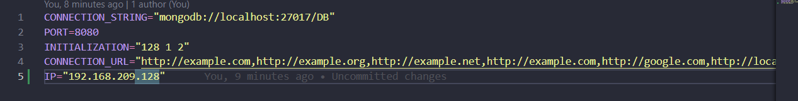
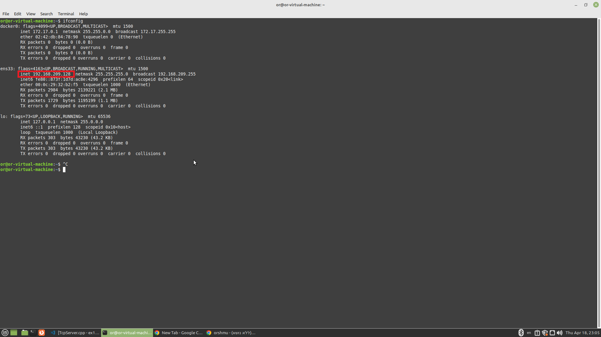
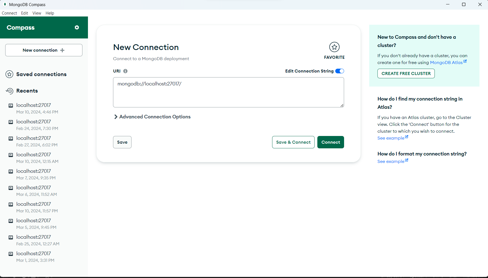
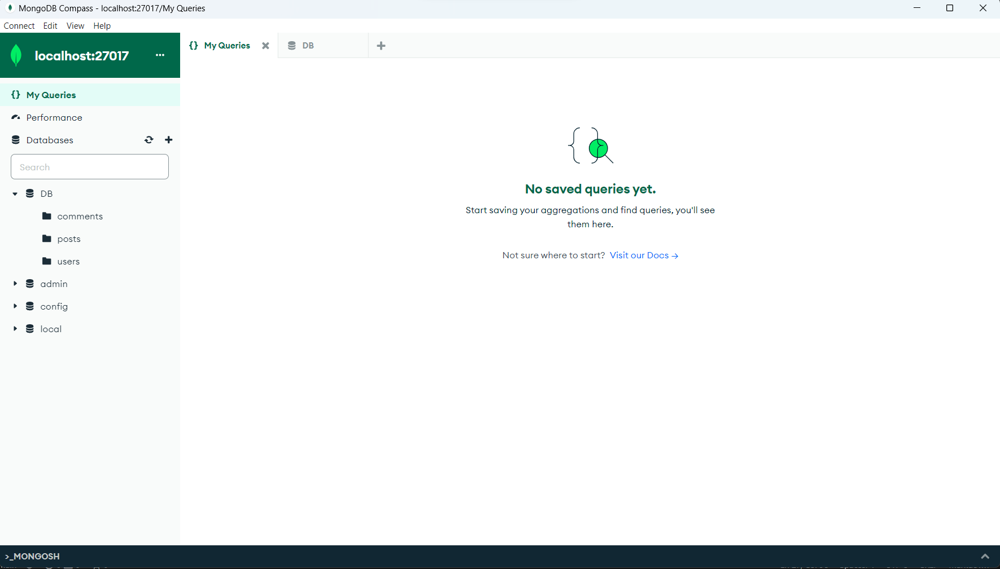

# FacebookServer

## Introduction

Welcome to Our Facebook server, this server is made for our React and Android Facebook apps that we developed during the course
Advanced Programming in BIU. this is a Node Js server so in order to run and use it you need some development environment that supports it. we recommend to you using VS-CODE for this server. in order to make this server work you will also need the software MongoDBCompass that you can install from the web. After this server is running you can use it in React/Android app by reading and following their folders readmes:

(U can also use out react app without clone react repository, u can only run the server and then enter to the web using the port of the server http://localhost:8080/ u can also change the port to whatever do you want in config -> .env.local)

In the part4 of the project we were requested to connect our server into a tcp server that runs a bloom filter of valid urls.
so, in order to make sure everything works well together you must also run the tcp server, 
Make sure you followed the readme of the folder "Bloom-Filter and TCP-Server" and run it before this one!!!!
 
If you want to read more about the bloom filter, the tcp server,the webstie or the android app please enter their folders and read their ReadMe files!

If you want to make the tcp server work on your computer you need to put the ip of your computer that the tcp server is running on,
(if you use a vmware virtual machine, you need to take its ip).

you need to change the address to your address in the ENV.local: 

after you have done that make sure your tcp server is already running and continue. 

also u can find your ip in linux running the command ifconfig

## some remarks for part4 

In the env file that is in this repo you have some urls that will be inserted into the bloom filter (in CONNECTION_URL), and you also have its size and number of hash functions that are working on the insertion(in INITIALIZATION). 

If you want to add some urls change the env file in CONNECTION_URL,Each URL need to be by our regax that means: this regular expression will match any string that starts with "http" or "https", followed by "://", followed by one or more non-whitespace characters. (look at those 6 examples that you already have there. also notice that each url is seperated by ',' ). 

## Here are 2 videos that show what our apps can do

React: https://www.youtube.com/watch?v=7xheojkxw5M 

Android: https://www.youtube.com/watch?v=onclwdYc8EU

## How to Run The Server? 

In order to run this server you first need to open the folder "Node js Server" that is in this repo in Vs-Code

Now you will also need to set up MongoDBCompass to work with this server, 
Open MongoDBCompass and start by clicking connect when you have this url in the box: 

After that, add a database named "DB" and add for it 3 collections: "users", "posts", "comments". It should look like this: 

After you have done that, go into the folder "Node js Server" and run in your terminal (Or in Vs-Code terminal) the command: 

npm install 

And after it finished, you can run the server with the command:

node app.js 

right now your server is running and you can use it for React and Android apps 
make sure you don't close the terminal of the running node js, because it will close the server...

## And thats it! please enjoy using our apps!
Written by: 

Ofek Yemini

Or Shmuel 

Eliya Rabia 

