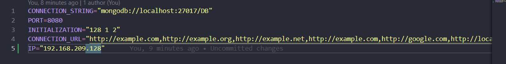
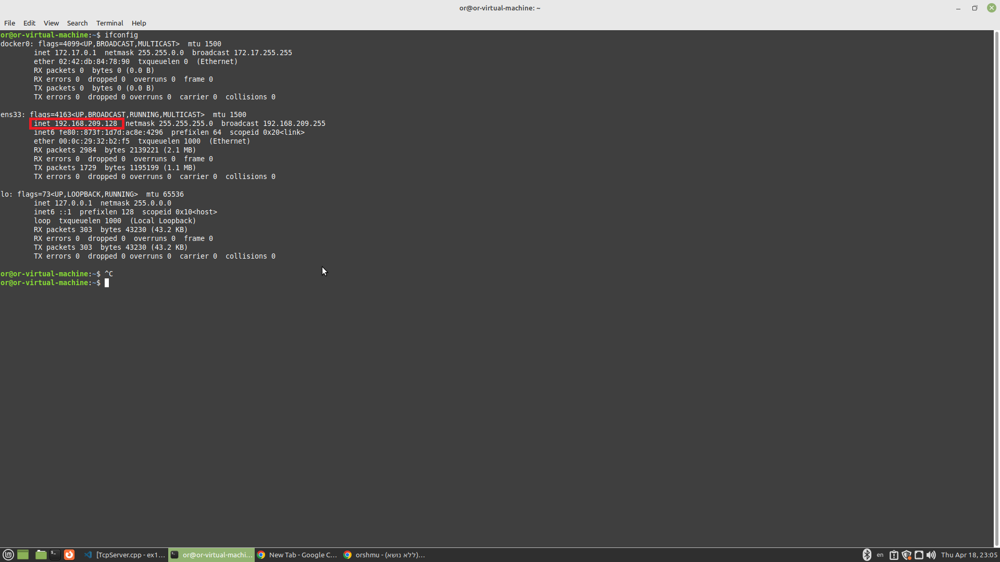
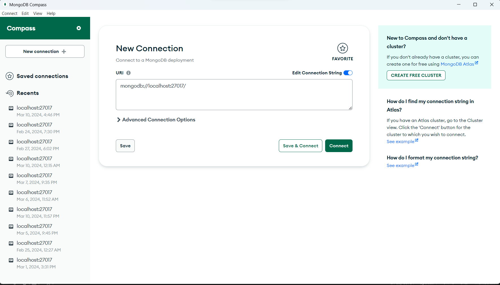
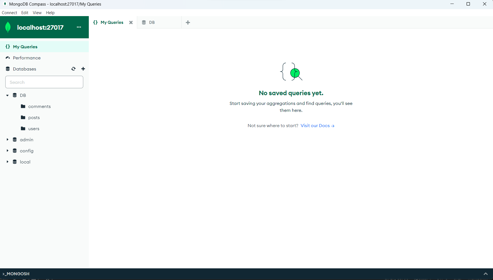

# Page 2 - Run the Node js server.

## About the Node js server

Welcome to the Facebook server, this server is made for our React and Android Facebook apps that we developed during the course
Advanced Programming in BIU. this is a Node Js server so in order to run and use it you need some development environment that supports it. we recommend to you use VS-CODE for this server. in order to make this server work you will also need the software MongoDBCompass that you can install from the web. After this server is running you can use it in React/Android app by reading and cloning their pages.

(U can also use our react app without clonning the react repository and follow its page!, u can only run this server and then enter to the web using the port of the server http://localhost:8080/ u can also change the port to whatever do you want in config -> .env.local)

In part 3 of the project we built this server and connected it to the website and android app we did in part 2 of the project.
In part4 of the project we were requested to connect our server into the TCP server that runs the bloom filter of invalid urls.

This server also contains an env file that is in charge of the size of the bloom filter, the number of hash functions that are working on it, the invalid urls that will enter to it.
so overall, in order to make sure everything works well together you must also run the TCP server, so make sure you already read page 1 first!!! 

We again suggest you to also read the ReadMe.md file of this repository in addition to this page. 

## Before running 
so, now that your TCP server is running from page 1 and you have MongoDbCompass, 

Lets download the zip file of the folder "Node js Server" and extract it.  

now open the folder in Vs-Code

If you want to decide what will be the size , hash functions and urls of the bloom filter, do this: 

*open the env file that is in this folder, this is what you will see there: 

 

you have some urls that will be inserted into the bloom filter (in CONNECTION_URL), and you also have its size and number of hash functions that are working on the insertion(in INITIALIZATION). 

If you want to add some urls change the env file in CONNECTION_URL,Each URL need to be by our regax that means: this regular expression will match any string that starts with "http" or "https", followed by "://", followed by one or more non-whitespace characters. (look at those 6 examples that you already have there. also notice that each url is seperated by ',').  

You also need to make the tcp server work on your computer you need to put the ip of your computer that the tcp server is running on,
(if you use a vmware virtual machine, you need to take its ip).

you need to change the address to your address in the ENV.local( where it is bolded in the pic up there).

after you have done that make sure your tcp server is already running and continue. 

also u can find your ip in linux running the command ifconfig

 

you can also see there in the env file the section "PORT_BLOOM=5555" this is the Tcp server port.

## Run The Server

After you did the last section, you already cloned the repo and connected to the tcp. 

Now you will also need to set up MongoDBCompass to work with this server, 
Open MongoDBCompass and start by clicking connect when you have this url in the box: 

After that, add a database named "DB" and add for it 3 collections: "users", "posts", "comments". It should look like this: 

After you have done that, go into the cloned folder and run in terminal the command: 

npm install 

And after it finished, you can run the server with the command:

node app.js 

Right now your server is running and you can use it for React and Android apps.

Make sure you don't close the terminal of the running node js!!, because it will close the server!

(also remeber to not close the running of the tcp server from the last page)

# Now 
So you alreay run tcp and node js, now you can choose which app you want to run:

Go to Page 3 for the facebook website. 

Go to Page 4 for the android app.

